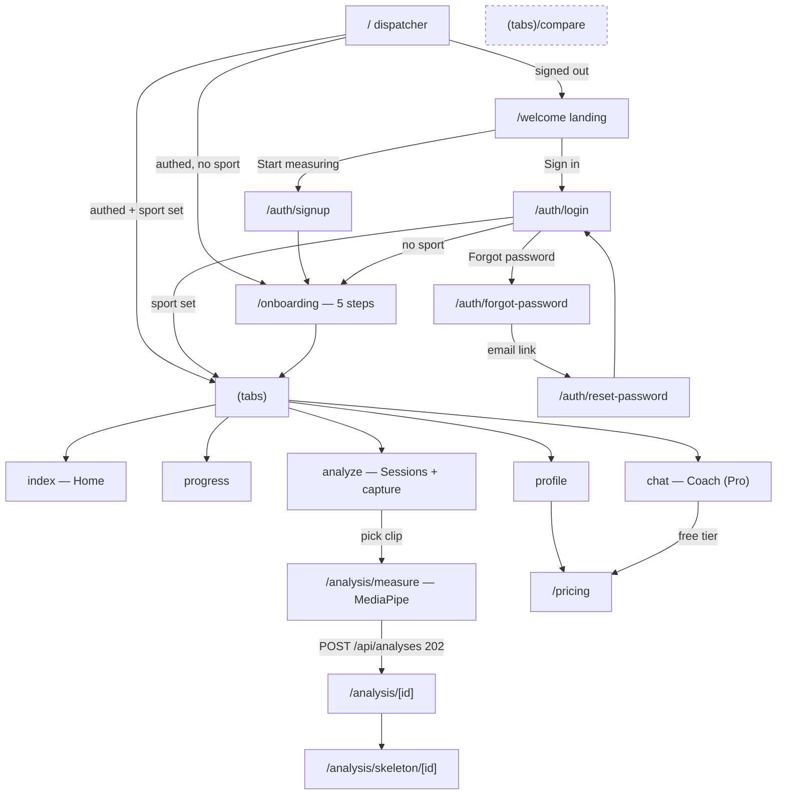

# User flows — a walkthrough script for checking the app actually runs

Written 2026-08-15.

This is a **test plan, not a report.** Every flow below was derived by reading
the routes and screens, not by running them. Nothing here is a claim that the
app works — it is the list of things to check, in the order a real user hits
them, with the expected result written down *before* testing so a wrong result
is obvious rather than rationalised.

Two of this project's worst bugs passed typecheck and all 403 tests. The only
thing that catches that class of failure is walking the app.

**How to use this:** go top to bottom with the simulator open. For each step,
compare against "Expected". When something differs, check the Metro log and the
simulator log before reading code:

```bash
xcrun simctl spawn 27BBE9C0-B829-491B-B135-01C7FFCD18ED log show --last 3m \
  --predicate 'processImagePath CONTAINS "4FormAI"' --style compact | tail -50
```

Startup commands and the five known traps are in `HANDOFF.md`. Trap 5 is the one
that bites first — "Can't reach the server" is almost always `.env`.

---

## The map



`compare` is deliberately off the tab bar (`href: null` in `(tabs)/_layout.tsx`)
— reachable by URL only. See "Expected dead ends".

---

## Flow 1 — Cold start, signed out

| Step | Expected |
|---|---|
| Launch app | Splash holds until fonts load, then landing. A blank/white hang here means font loading, not routing (`app/_layout.tsx` returns `null` until `fontsLoaded`) |
| Landing renders | Headline "Your technique, measured.", the 142° caliper mark, 8 sport chips + "+13 more", 3 value props, two buttons, "Free to start. No card required." |
| Scroll | Nothing trapped under the floating tab bar (no tab bar on this screen) |

**Watch for (updated 2026-08-15):** `/` is now a render-time dispatcher
(`app/index.tsx` returns a `<Redirect>`); the landing screen itself lives at
`/welcome`. A signed-in user must never see the landing screen at all — there
is no effect to fire and nothing paints first. Seeing marketing while signed
in means the dispatcher or the tabs guard regressed.

---

## Flow 2 — Sign up

`POST /api/auth/signup`

| Step | Expected |
|---|---|
| Tap "Start measuring" | `/auth/signup` |
| Submit with password < 8 chars | Rejected. Floor is 8, no composition rules (NIST SP 800-63B) |
| Submit with an under-13 date of birth | **Generic** validation message, *not* "you are too young". Deliberate — see the comment at `routes/auth.ts:89`. The screen should explain the 13+ requirement up front, before typing |
| Submit an email that already exists | Non-enumerating response — must not reveal that the account exists |
| Valid submission | Account created, token stored in **SecureStore** (not AsyncStorage), lands on `/onboarding` |

**Check:** age gate copy appears *before* the date field, not as an error after.

---

## Flow 3 — Onboarding (5 steps)

`PATCH /api/profile`

| Step | Question | Continue enabled when |
|---|---|---|
| 1 | Pick the movements you train most | ≥1 sport (multi-select) |
| 2 | Where are you at? | a level chosen |
| 3 | What are you training for? | ≥1 goal |
| 4 | Anything giving you trouble? | ≥1 concern ("None right now" is exclusive) |
| 5 | How many sessions a week? | always (defaults to 3) |

**Expected:** first sport picked becomes the primary `profile.sport`; the rest
go into goals context. On finish → `(tabs)`.

**Watch for:** "None right now" must clear the other concern chips, and picking
another concern must clear it. That exclusivity is hand-rolled (`toggle()`).

**Why it matters beyond onboarding:** `profile.sport` is what routes an
authenticated user to `(tabs)` vs back to `/onboarding`. If it fails to save,
the user is stuck in an onboarding loop on every launch.

---

## Flow 4 — Log in / out

| Step | Expected |
|---|---|
| Wrong password | Generic credentials message. Must not distinguish "no such user" from "wrong password" |
| Repeated wrong attempts | Lockout + progressive delay engage |
| Correct credentials | → `(tabs)` if sport set, else `/onboarding` |
| Profile → Sign out | Confirm dialog, then `/welcome`. The old `replace("/")` resolved *inside* the tab navigator and stranded a signed-out user on Home — fixed 2026-08-15 by giving `/` a single owner |
| Kill and relaunch while signed in | Straight to `(tabs)`, no landing flash — structural now (render-time redirect), not timing-dependent |
| Deep link to `/profile` signed out | Tabs layout redirects to `/welcome` |

---

## Flow 5 — Password reset

Verified end-to-end previously against a real inbox; re-check after any domain
or `MAIL_FROM` change.

`POST /api/auth/forgot-password` → email → `GET /api/reset-password` (server-rendered
landing) → `POST /api/auth/reset-password`

| Step | Expected |
|---|---|
| Request for an unknown email | Same response as a known one (non-enumerating) |
| Email arrives | **Only reaches the Resend account owner today** — `MAIL_FROM` is unverified. This is to-do #2, not a bug |
| Follow the link | Reset landing page renders |
| Set new password | Old password stops working; token refused on replay |

---

## Flow 5b — Apple / Google sign-in

Added 2026-08-31. **Requires a native build** (Expo Go cannot do either) and the
client IDs from `docs/FEDERATED-SIGN-IN.md`; the buttons are hidden until those
are set, so on a build without them this flow correctly does not exist.

One entry point, `POST /api/auth/oauth`, with three outcomes:

| What the tester does | Expected |
|---|---|
| Tap Continue with Apple/Google, new person | Name + date-of-birth screen, then straight into onboarding |
| Same person signs in again later | Straight in, no second birth-date prompt |
| Tap it with an address that already has a password account | "Connect your account" — asks for that account's password once |
| Enter the wrong password on that screen | The **same** message as a failed sign-in, and it counts toward the lockout |
| Connect successfully, then sign out | Both the password *and* the provider now open the same account |
| Cancel out of the provider sheet | Returns to the screen with no error shown — cancelling is not a failure |
| Reload the browser on the link/birth-date screen (web) | Bounces back to sign-in; the continuation token is deliberately not in the URL |
| Apple, second time as a "new" user | Revoke under iOS Settings → your name → Sign in with Apple first, or Apple returns no email and the flow stops |

The one to watch on iOS: Apple returns the user's **name and email only on the
first authorization**. If the birth-date screen is abandoned, the next attempt
has no name to prefill — that is Apple's behaviour, not a bug, and the field is
editable.

---

## Flow 6 — Measure a clip (the core loop)

This is the flow the product is for. Test it most.

`POST /api/analyses` → `202` → client polls `GET /api/analyses/:id`

| Step | Expected |
|---|---|
| Tap the cobalt **+** in the tab bar | Sessions screen capture path |
| First use | Photo permission prompt. Denying shows a "Photo access needed" alert pointing at Settings |
| Pick a video still in iCloud | Specific message: "This video is still in iCloud. Open it in Photos, let it download fully, then try again." — not a generic error |
| Pick a good clip | Title + sport sheet, sport prefilled from profile |
| Confirm | `/analysis/measure` — a **hidden WebView** runs MediaPipe over the video, accumulating real joint angles |
| During measurement | Progress reflects actual frames (`done/total`). Back gesture disabled (`gestureEnabled: false`) |
| Measurement completes | Analysis created **only now** — never before real metrics exist |
| Sessions list | New row under "MEASURING", polling every 4s, moves to "MEASURED" when complete |

**The specific regression to watch for:** the app used to create the analysis
straight from the picker and show a *fake* progress list for work that never
ran, with the server asking Claude to invent scores from the title. If
measurement finishes suspiciously fast, or progress never shows real frame
counts, that theatre is back.

**Also check:** `submitted` ref guards against duplicate analyses if the WebView
fires `metrics` twice. Measure one clip → confirm exactly one row appears.

**Quota:** free tier is **3 analyses per month** (`TIER_LIMITS.free`). The 4th
returns `403 UPGRADE_REQUIRED` with a real reset date. Limits are enforced
*monthly* — an earlier version advertised "3 per month" while enforcing 3 ever.

---

## Flow 7 — Analysis detail & skeleton

| Step | Expected |
|---|---|
| Tap a measured session | `/analysis/[id]`, own header (hero bleeds to top edge) |
| Write-up copy | Plain-language instructions, **not** recited joint angles. Jargon translation applies here and in chat |
| A flagged joint | Always shows the angle that produced it — "flags carry evidence" is a promise on the landing page |
| Open skeleton | `/analysis/skeleton/[id]` as a **fullScreenModal**. Exact degrees are kept here by design |
| Delete an analysis | `DELETE /api/analyses/:id`, row disappears, local video cleaned up (`deleteVideo`). **The month's quota slot is not refunded** (soft delete under the hood) and the session's point leaves the Progress trend |
| Provenance stamp | `4 REPS · 90 FRAMES MEASURED` when the movement repeated; frames alone otherwise. Same phrasing on Home and here (`utils/provenance.ts`) |
| Sub-score deltas | `+N`/`−N` beside each dimension vs the previous measured session, only when both clips measured it |

---

## Flow 8 — Coach (chat) — **Pro-gated**

| Step | Expected |
|---|---|
| Open Coach as a **free** user | Locked state: "…which angle, which clip. Included with Pro." → `/pricing` |
| Send a message as free user | `403 UPGRADE_REQUIRED` |
| Reference someone else's analysis | `404` — ownership is resolved server-side |
| Coach unavailable | `503`, and **your message is still saved** so retry does not duplicate it |

> **Resolved 2026-08-15.** The suspicion was right: `GET /api/chat` never
> returns `UPGRADE_REQUIRED`, so a free user saw the full chat UI and hit the
> wall only after typing. `locked` now derives from the subscription tier in
> the auth context — the wall shows before any effort — and an
> `UPGRADE_REQUIRED` from the server still forces the locked state if client
> and server ever disagree about the tier.

---

## Flow 9 — Progress

| Step | Expected |
|---|---|
| 0–1 measured sessions | "Measure two or more sessions and your trend appears here." |
| 2 sessions | Trend appears; closed-flag comparison possible (needs ≥2) |
| 3+ sessions | **The cobalt band appears** — interquartile range, `values.length < 3` returns `null` |
| Week strip | Mon–Sun, marked where a session was measured |

**This is to-do #28, and it is a product problem, not a bug:** the band is the
core idea and it is invisible for a new user's first two clips. Judge it as a
new user would — it is the first thing to feel empty.

---

## Flow 10 — Profile & account

| Row | Expected |
|---|---|
| Avatar (camera badge) | Photo sheet: pick square-cropped photo or remove. Device-local only — "never uploaded" line must stay true; deleting the account removes the photo |
| Stats | MEASURED count, DAY STREAK, FLAGS CLOSED |
| Name / Sport / Level / Weekly goal | Inline edit sheet, saves via `PATCH /api/profile` |
| How measurement works / How data is handled | Explanatory alerts |
| Privacy Policy / Terms | **Will fail or point nowhere until to-do #3** — `EXPO_PUBLIC_LEGAL_BASE_URL` is unset. Expected, not a bug |
| Support | Same — `EXPO_PUBLIC_SUPPORT_EMAIL` unset |
| Version | 1.0.0 |
| Sign out | Confirm → `/` |
| Delete account | `DELETE /api/profile/account`. **Destructive and real** — only test on a throwaway account, never on the production account you signed up with |

---

## Flow 11 — Pricing

| Step | Expected |
|---|---|
| Open `/pricing` (modal) | Banner: "Paid plans aren't on sale yet… nothing can be purchased or charged right now." |
| Pro button | Reads **"Coming soon"**, dimmed. Tapping says nothing has been charged and the plan is unchanged |
| Elite | Shown as unavailable with a reason. It was withdrawn because its features do not exist |
| Downgrade to free | Works — self-downgrade is the only entitlement change a client may make |

**The invariant to protect:** the client may never assert its own entitlement.
Tier rises only from a server-verified receipt. Oscar's fork writes
`req.body.tier` straight to the DB — any user can grant themselves Elite. If a
change ever makes tier client-settable here, that is a critical regression.

---

## Expected dead ends — not bugs

Do not file these:

- **Compare screen** — Elite-only, never built. Off the tab bar by design. Its
  "similarity scores" are hard-coded mock data.
- **Purchases** — no RevenueCat keys, `billingEnabled` false (to-do #6).
- **Legal / support links** — no domain yet (to-do #1, #3).
- **Email beyond the Resend owner** — `MAIL_FROM` unverified (to-do #2).
- **Sentry silence** — wired but inert without `SENTRY_DSN` (to-do #10).
- **Priority processing** — `TIER_LIMITS.priorityProcessing` is set but nothing
  reads it. Every analysis runs the same path at the same speed. It is
  deliberately not advertised.

---

## Checklist

Core loop — if only one thing gets tested, test this:

- [ ] Sign up → onboarding → tabs, no loop
- [ ] Pick clip → real frame-by-frame measurement → exactly one session row
- [ ] Session completes → analysis reads as instructions, not joint angles
- [ ] Flagged joint shows its evidence angle
- [ ] Skeleton opens full-screen with exact degrees
- [ ] 4th analysis in a month → `403` with a real reset date
- [ ] Relaunch signed in → straight to tabs, no landing flash

Then:

- [ ] Free user hits the Coach wall (see Flow 8 caveat)
- [ ] Progress: empty → trend at 2 → band at 3
- [ ] Profile edits persist across relaunch
- [ ] Pricing charges nothing and says so
- [ ] Sign out → landing

---

## When something breaks

1. **Metro log first**, then the simulator log. Both before opening code.
2. A red screen after a dependency change is usually a **stale Metro cache** —
   `expo start --clear` before theorising about the dependency tree (trap 3).
3. A network failure is usually **`.env`** (trap 5), and `.env` changes need a
   Metro restart because `EXPO_PUBLIC_*` is inlined at build time.
4. `.env` currently points at the **live Railway API**, so anything you do here
   writes to production Supabase. Use throwaway accounts for destructive tests.
